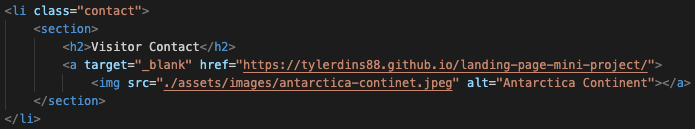
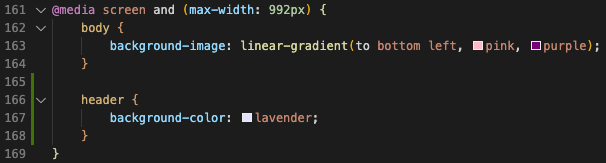
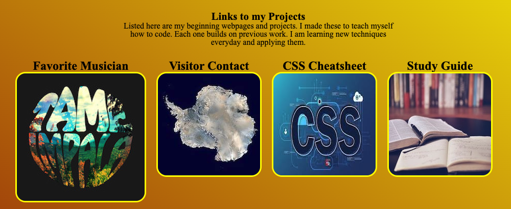

# Tyler-Dins-Portfolio

## Description

This is my first portfolio. On this page you will find a small description decribing me. A section with that will have the few applications I have made thus far. Lastly is a contact section. 

There a few pictures throughout the page that reference who I am and my life. 

This was my first application built from scratch using an in-depth amount of CSS and HTML. For HTML I used id links and images to take you to new pages. In CSS I tried to incorporate new features such as the media queries and a smooth layout design. This is a work in progress and I hope to continue to improve it. 

Inputing a image that opens a link in a new tab was a big accomplishment in my early states of coding. By click a thumbnail on my portfolio, it opens a new tab on the browser. This new tab is a link that is a previous application I have built. 

I also deployed a Media Query in my style.css file so that it changes colors on different browsers. 

This last scrrenshot here is a snippet of the completed page. The 4 images here link to a different page that is a project I have built. They are nicely aligned and feature a shadow style when you scroll over them. 

## Installation

N/A

## Usage

Visit the Website: https://tylerdins88.github.io/tyler-dins-portfolio/

## Credits

I take credit for building a webpage that involved putting "who I am and what I've done" on the internet. 